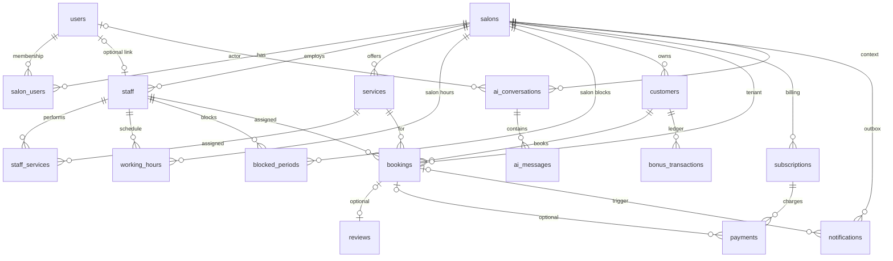

# Database design — Liman Salon MVP v0.1

PostgreSQL schema design for the modular-monolith beauty salon SaaS. This document is the reference for SQLAlchemy models and Alembic migrations; it does not contain implementation code.

**Related:** [architecture.md](architecture.md) (tenancy, modules, availability), [AGENTS.md](../AGENTS.md) (isolation and access rules).

---

## Table of contents

1. [Design principles](#design-principles)
2. [Primary keys and identifiers](#primary-keys-and-identifiers)
3. [Timestamps and time zones](#timestamps-and-time-zones)
4. [Tenant isolation](#tenant-isolation)
5. [Entity relationships (ER overview)](#entity-relationships-er-overview)
6. [Tables](#tables)
   - [users](#users)
   - [salons](#salons)
   - [salon_users](#salon_users)
   - [staff](#staff)
   - [services](#services)
   - [staff_services](#staff_services)
   - [working_hours](#working_hours)
   - [blocked_periods](#blocked_periods)
   - [customers](#customers)
   - [bookings](#bookings)
   - [bonus_transactions](#bonus_transactions)
   - [reviews](#reviews)
   - [subscriptions](#subscriptions)
   - [payments](#payments)
   - [notifications](#notifications)
   - [ai_conversations](#ai_conversations)
   - [ai_messages](#ai_messages)
7. [Enumerations and lifecycles](#enumerations-and-lifecycles)
   - [Booking status](#booking-status)
   - [Bonus transaction types](#bonus-transaction-types)
   - [Review status](#review-status)
   - [Subscription and payment states](#subscription-and-payment-states)
8. [Smart Gap Engine (availability)](#smart-gap-engine-availability)
9. [Booking overlap protection](#booking-overlap-protection)
10. [Indexing strategy](#indexing-strategy)
11. [Foreign key delete and update behavior](#foreign-key-delete-and-update-behavior)
12. [Implementation notes (FastAPI / SQLAlchemy / Alembic)](#implementation-notes-fastapi--sqlalchemy--alembic)

---

## Design principles

- **Tenant key:** `salon_id` on all salon-owned rows; application services always filter by authenticated or resolved salon context.
- **Availability:** `working_hours` and `blocked_periods` define capacity; `bookings` define commitments (with time-limited holds for `pending` public reservations — see [Booking overlap protection](#booking-overlap-protection)). Free bookable gaps are computed by the [Smart Gap Engine](#smart-gap-engine-availability); no separate “slot inventory” table in MVP.
- **Bonuses (MVP):** Loyalty is **salon-scoped**, not platform-global. Each salon maintains its own customer ledger (`bonus_transactions`) and cached balance (`customers.bonus_balance_cents`). Product/README “global bonuses” means a **cross-cutting module within a tenant** (usable across booking and checkout flows), **not** a shared wallet across salons or a platform-wide currency.
- **Providers:** `notifications`, `payments`, and `subscriptions` store provider-agnostic fields plus opaque provider metadata (JSON).
- **AI:** `ai_conversations` / `ai_messages` are an audit log of assistant interactions; the AI layer never reads or writes the database directly.
- **Audit:** `created_at` and `updated_at` on mutable business entities; append-only logs omit `updated_at` where noted.

---

## Primary keys and identifiers

| Choice | **UUID (`uuid`, PostgreSQL `gen_random_uuid()`)** |
|--------|---------------------------------------------------|
| Rationale | Stable identifiers across environments; safe to expose in public booking URLs and APIs without sequential enumeration; aligns with FastAPI/Pydantic `UUID` types and SQLAlchemy 2.x `Uuid` columns; no coordination needed when generating IDs in the app layer before insert. |
| Convention | Column name `id` on every table; foreign keys named `{entity}_id` (e.g. `salon_id`, `staff_id`). |

Natural keys (e.g. salon `slug`, user `email`) have **unique constraints** but are not primary keys.

---

## Timestamps and time zones

| Rule | Detail |
|------|--------|
| Storage type | `TIMESTAMPTZ` for all instants (bookings, blocks, payments, messages). |
| Canonical zone | **UTC** in the database; salon display uses `salons.timezone` (IANA name, e.g. `Asia/Almaty`). |
| Date-only fields | `DATE` for calendar dates where wall-clock day matters without a time (e.g. bonus expiry date). |
| Local time-of-day | `working_hours` uses `TIME` for recurring weekly windows interpreted in the salon (or staff) timezone. |
| Application | SQLAlchemy: timezone-aware datetimes; Alembic defaults: `server_default=func.now()` on `created_at` where appropriate. |
| `updated_at` | Set by application on update (trigger optional later); NOT NULL with default at insert. |

---

## Tenant isolation

| Scope | Tables | Notes |
|-------|--------|--------|
| **Global (platform)** | `users` | Identity spans salons; authorization is via `salon_users`. |
| **Tenant root** | `salons` | Defines tenant; no `salon_id` on self. |
| **Tenant-scoped** | `salon_users`, `staff`, `services`, `staff_services`, `working_hours`, `blocked_periods`, `customers`, `bookings`, `bonus_transactions`, `reviews`, `subscriptions`, `payments`, `notifications`, `ai_conversations`, `ai_messages` | Every row includes `salon_id` NOT NULL (directly or enforced via composite FK to parent). |
| **Junction / child** | `staff_services`, `ai_messages` | `salon_id` duplicated on junction rows for cheap tenant filters and FK consistency checks. |

**Application rule:** every query and mutation on tenant-scoped tables includes `WHERE salon_id = :context_salon_id` (or equivalent join through `salons`). Public booking resolves `salon_id` from slug/domain before any write.

**Database rule (defense in depth):** composite foreign keys where parent is tenant-owned, e.g. `bookings (salon_id, staff_id) → staff (salon_id, id)`, `payments (salon_id, subscription_id) → subscriptions (salon_id, id)`, and `ai_messages (salon_id, conversation_id) → ai_conversations (salon_id, id)`, prevent cross-tenant parent references.

---

## Entity relationships (ER overview)



**Cardinality notes**

- One `user` may belong to many `salons` via `salon_users` (different roles per salon).
- One `staff` row belongs to one `salon`; optionally links one `user` for login/dashboard.
- `bookings` require `customer`, `staff`, `service`, and `salon`; snapshot price/duration at booking time optional but recommended for history.
- `payments` link primarily to `subscriptions` (SaaS billing) and optionally to `bookings` (future customer checkout); not both required.
- `reviews` typically one per completed booking (unique on `booking_id` when present).
- `bonus_transactions` and `customers.bonus_balance_cents` are always scoped to one `salon_id`; the same person as a customer in two salons has two independent bonus balances.

---

## Tables

### users

Platform identity (login). Not tenant-scoped.

| Column | Type | Null | Default | Constraints / notes |
|--------|------|------|---------|---------------------|
| `id` | `UUID` | NOT NULL | `gen_random_uuid()` | **PK** |
| `email` | `VARCHAR(320)` | NOT NULL | | **UNIQUE**; case-insensitive uniqueness via unique index on `lower(email)` |
| `password_hash` | `VARCHAR(255)` | NULL | | NULL if OAuth-only later |
| `full_name` | `VARCHAR(200)` | NOT NULL | | |
| `phone` | `VARCHAR(32)` | NULL | | E.164 normalized in app |
| `is_active` | `BOOLEAN` | NOT NULL | `true` | |
| `is_platform_admin` | `BOOLEAN` | NOT NULL | `false` | Rare; bypass not for tenant data in MVP |
| `email_verified_at` | `TIMESTAMPTZ` | NULL | | |
| `last_login_at` | `TIMESTAMPTZ` | NULL | | |
| `created_at` | `TIMESTAMPTZ` | NOT NULL | `now()` | |
| `updated_at` | `TIMESTAMPTZ` | NOT NULL | `now()` | |

**Indexes**

- `UNIQUE (lower(email))` — login lookup.
- `INDEX (is_active)` — admin lists (partial index `WHERE is_active` optional).

---

### salons

Tenant root.

| Column | Type | Null | Default | Constraints / notes |
|--------|------|------|---------|---------------------|
| `id` | `UUID` | NOT NULL | `gen_random_uuid()` | **PK** |
| `name` | `VARCHAR(200)` | NOT NULL | | |
| `slug` | `VARCHAR(80)` | NOT NULL | | **UNIQUE**; public booking URL |
| `timezone` | `VARCHAR(64)` | NOT NULL | | IANA, e.g. `Europe/Moscow` |
| `locale` | `VARCHAR(10)` | NOT NULL | `'en'` | BCP 47 |
| `currency_code` | `CHAR(3)` | NOT NULL | | ISO 4217 |
| `address_line1` | `VARCHAR(255)` | NULL | | |
| `address_line2` | `VARCHAR(255)` | NULL | | |
| `city` | `VARCHAR(100)` | NULL | | |
| `country_code` | `CHAR(2)` | NULL | | ISO 3166-1 alpha-2 |
| `phone` | `VARCHAR(32)` | NULL | | |
| `email` | `VARCHAR(320)` | NULL | | Contact, not auth |
| `settings` | `JSONB` | NOT NULL | `'{}'` | Per-salon business settings (v0.1: optional `booking.public_hold_seconds`; validated in app). Branding logo = Media; buffers = `services`; timezone/currency = columns above |
| `is_active` | `BOOLEAN` | NOT NULL | `true` | Soft disable tenant |
| `created_at` | `TIMESTAMPTZ` | NOT NULL | `now()` | |
| `updated_at` | `TIMESTAMPTZ` | NOT NULL | `now()` | |

**Indexes**

- `UNIQUE (slug)`.
- `INDEX (is_active)` where needed for platform admin.

**CHECK**

- `char_length(slug) >= 2`
- `timezone` validated in application against IANA list

---

### salon_users

Membership and salon-scoped role for a platform user.

| Column | Type | Null | Default | Constraints / notes |
|--------|------|------|---------|---------------------|
| `id` | `UUID` | NOT NULL | `gen_random_uuid()` | **PK** |
| `salon_id` | `UUID` | NOT NULL | | **FK → salons(id)** ON DELETE CASCADE |
| `user_id` | `UUID` | NOT NULL | | **FK → users(id)** ON DELETE CASCADE |
| `role` | `VARCHAR(32)` | NOT NULL | | e.g. `owner`, `admin`, `staff`, `receptionist` |
| `is_active` | `BOOLEAN` | NOT NULL | `true` | |
| `invited_at` | `TIMESTAMPTZ` | NULL | | |
| `joined_at` | `TIMESTAMPTZ` | NULL | | |
| `created_at` | `TIMESTAMPTZ` | NOT NULL | `now()` | |
| `updated_at` | `TIMESTAMPTZ` | NOT NULL | `now()` | |

**Unique**

- `UNIQUE (salon_id, user_id)` — one membership row per pair.

**Indexes**

- `INDEX (user_id)` — “my salons” for logged-in user.
- `INDEX (salon_id, role)` — list admins/staff for salon.

**CHECK**

- `role IN ('owner', 'admin', 'staff', 'receptionist')` (extend via migration when approved)

---

### staff

Bookable staff member within a salon. Optional link to `users` for app login.

| Column | Type | Null | Default | Constraints / notes |
|--------|------|------|---------|---------------------|
| `id` | `UUID` | NOT NULL | `gen_random_uuid()` | **PK** |
| `salon_id` | `UUID` | NOT NULL | | **FK → salons(id)** ON DELETE RESTRICT |
| `user_id` | `UUID` | NULL | | **FK → users(id)** ON DELETE SET NULL |
| `display_name` | `VARCHAR(200)` | NOT NULL | | |
| `title` | `VARCHAR(100)` | NULL | | e.g. “Senior stylist” |
| `bio` | `TEXT` | NULL | | |
| `color_hex` | `CHAR(7)` | NULL | | Calendar UI |
| `is_bookable` | `BOOLEAN` | NOT NULL | `true` | |
| `is_active` | `BOOLEAN` | NOT NULL | `true` | |
| `sort_order` | `INTEGER` | NOT NULL | `0` | |
| `created_at` | `TIMESTAMPTZ` | NOT NULL | `now()` | |
| `updated_at` | `TIMESTAMPTZ` | NOT NULL | `now()` | |

**Unique**

- `UNIQUE (salon_id, id)` — enables composite FKs from tenant children.
- Partial unique: `UNIQUE (salon_id, user_id) WHERE user_id IS NOT NULL` — one staff profile per user per salon.

**Indexes**

- `INDEX (salon_id, is_active, is_bookable)` — public staff list.
- `INDEX (user_id)` WHERE `user_id IS NOT NULL`.

**CHECK**

- `color_hex IS NULL OR color_hex ~ '^#[0-9A-Fa-f]{6}$'`

---

### services

Salon service catalog (bookable offerings).

| Column | Type | Null | Default | Constraints / notes |
|--------|------|------|---------|---------------------|
| `id` | `UUID` | NOT NULL | `gen_random_uuid()` | **PK** |
| `salon_id` | `UUID` | NOT NULL | | **FK → salons(id)** ON DELETE RESTRICT |
| `name` | `VARCHAR(200)` | NOT NULL | | |
| `description` | `TEXT` | NULL | | |
| `duration_minutes` | `INTEGER` | NOT NULL | | Slot length for availability |
| `buffer_before_minutes` | `INTEGER` | NOT NULL | `0` | |
| `buffer_after_minutes` | `INTEGER` | NOT NULL | `0` | |
| `price_cents` | `INTEGER` | NOT NULL | | Minor units; `salons.currency_code` applies |
| `is_active` | `BOOLEAN` | NOT NULL | `true` | |
| `sort_order` | `INTEGER` | NOT NULL | `0` | |
| `created_at` | `TIMESTAMPTZ` | NOT NULL | `now()` | |
| `updated_at` | `TIMESTAMPTZ` | NOT NULL | `now()` | |

**Unique**

- `UNIQUE (salon_id, id)`.

**Indexes**

- `INDEX (salon_id, is_active, sort_order)`.

**CHECK**

- `duration_minutes > 0`
- `buffer_before_minutes >= 0 AND buffer_after_minutes >= 0`
- `price_cents >= 0`

---

### staff_services

Which staff can perform which services (eligibility for booking and availability).

| Column | Type | Null | Default | Constraints / notes |
|--------|------|------|---------|---------------------|
| `id` | `UUID` | NOT NULL | `gen_random_uuid()` | **PK** |
| `salon_id` | `UUID` | NOT NULL | | **FK → salons(id)** ON DELETE CASCADE |
| `staff_id` | `UUID` | NOT NULL | | **FK → staff(salon_id, id)** ON DELETE CASCADE |
| `service_id` | `UUID` | NOT NULL | | **FK → services(salon_id, id)** ON DELETE CASCADE |
| `created_at` | `TIMESTAMPTZ` | NOT NULL | `now()` | |

**Unique**

- `UNIQUE (staff_id, service_id)`.
- `UNIQUE (salon_id, staff_id, service_id)`.

**Indexes**

- `INDEX (salon_id, service_id)` — staff for a service.
- `INDEX (salon_id, staff_id)` — services for staff.

---

### working_hours

Recurring weekly availability for salon-wide default and/or specific staff.

| Column | Type | Null | Default | Constraints / notes |
|--------|------|------|---------|---------------------|
| `id` | `UUID` | NOT NULL | `gen_random_uuid()` | **PK** |
| `salon_id` | `UUID` | NOT NULL | | **FK → salons(id)** ON DELETE CASCADE |
| `staff_id` | `UUID` | NULL | | **FK → staff(salon_id, id)** ON DELETE CASCADE; NULL = salon default hours |
| `day_of_week` | `SMALLINT` | NOT NULL | | 0 = Monday … 6 = Sunday (document convention in app) |
| `start_time` | `TIME` | NOT NULL | | Local to salon/staff timezone |
| `end_time` | `TIME` | NOT NULL | | |
| `effective_from` | `DATE` | NULL | | Optional seasonal schedule |
| `effective_to` | `DATE` | NULL | | |
| `created_at` | `TIMESTAMPTZ` | NOT NULL | `now()` | |
| `updated_at` | `TIMESTAMPTZ` | NOT NULL | `now()` | |

**Indexes**

- `INDEX (salon_id, staff_id, day_of_week)`.
- `INDEX (salon_id, day_of_week) WHERE staff_id IS NULL` — salon defaults.

**CHECK**

- `day_of_week BETWEEN 0 AND 6`
- `start_time < end_time`
- `effective_to IS NULL OR effective_from IS NULL OR effective_from <= effective_to`

---

### blocked_periods

Time off, holidays, manual blocks (salon-wide or staff-specific).

| Column | Type | Null | Default | Constraints / notes |
|--------|------|------|---------|---------------------|
| `id` | `UUID` | NOT NULL | `gen_random_uuid()` | **PK** |
| `salon_id` | `UUID` | NOT NULL | | **FK → salons(id)** ON DELETE CASCADE |
| `staff_id` | `UUID` | NULL | | **FK → staff(salon_id, id)** ON DELETE CASCADE; NULL = entire salon |
| `starts_at` | `TIMESTAMPTZ` | NOT NULL | | UTC |
| `ends_at` | `TIMESTAMPTZ` | NOT NULL | | UTC |
| `reason` | `VARCHAR(255)` | NULL | | |
| `block_type` | `VARCHAR(32)` | NOT NULL | `'manual'` | `manual`, `holiday`, `time_off` |
| `created_by_user_id` | `UUID` | NULL | | **FK → users(id)** ON DELETE SET NULL |
| `created_at` | `TIMESTAMPTZ` | NOT NULL | `now()` | |
| `updated_at` | `TIMESTAMPTZ` | NOT NULL | `now()` | |

**Indexes**

- `INDEX (salon_id, staff_id, starts_at, ends_at)` — availability queries.
- `INDEX (salon_id, starts_at)` — calendar range scans.

**CHECK**

- `starts_at < ends_at`
- `block_type IN ('manual', 'holiday', 'time_off')`

---

### customers

Salon-scoped customer profile (walk-in and registered guests).

| Column | Type | Null | Default | Constraints / notes |
|--------|------|------|---------|---------------------|
| `id` | `UUID` | NOT NULL | `gen_random_uuid()` | **PK** |
| `salon_id` | `UUID` | NOT NULL | | **FK → salons(id)** ON DELETE RESTRICT |
| `user_id` | `UUID` | NULL | | **FK → users(id)** ON DELETE SET NULL; optional linked account |
| `full_name` | `VARCHAR(200)` | NOT NULL | | |
| `email` | `VARCHAR(320)` | NULL | | |
| `phone` | `VARCHAR(32)` | NULL | | Primary contact for WhatsApp |
| `notes` | `TEXT` | NULL | | Internal |
| `bonus_balance_cents` | `INTEGER` | NOT NULL | `0` | **Salon-scoped** denormalized cache; authoritative ledger in `bonus_transactions` (same `salon_id`). Not transferable to other salons. |
| `marketing_opt_in` | `BOOLEAN` | NOT NULL | `false` | General marketing (email/SMS campaigns, promotions). Independent of WhatsApp transactional consent. |
| `whatsapp_opt_in` | `BOOLEAN` | NOT NULL | `false` | Consent to receive WhatsApp messages from this salon (transactional and, if policy allows, marketing on WhatsApp). |
| `whatsapp_opt_in_at` | `TIMESTAMPTZ` | NULL | | When the customer last affirmatively opted in to WhatsApp for this salon; NULL if never opted in. Set/cleared by application when consent changes. |
| `created_at` | `TIMESTAMPTZ` | NOT NULL | `now()` | |
| `updated_at` | `TIMESTAMPTZ` | NOT NULL | `now()` | |

**Unique**

- `UNIQUE (salon_id, id)`.
- Partial: `UNIQUE (salon_id, lower(email)) WHERE email IS NOT NULL`.
- Partial: `UNIQUE (salon_id, phone) WHERE phone IS NOT NULL` (if business requires; otherwise app-level only).

**Indexes**

- `INDEX (salon_id, full_name)` — admin search.
- `INDEX (salon_id, phone)`.
- `INDEX (user_id)` WHERE `user_id IS NOT NULL`.

**CHECK**

- `bonus_balance_cents >= 0` (or allow negative with credit limit in app; MVP: non-negative)

**Consent (application rules)**

- WhatsApp sends (`notifications.channel = 'whatsapp'`) require `whatsapp_opt_in = true` and a valid `phone` unless the message class is exempt by policy (document in notifications module).
- `marketing_opt_in` does not imply `whatsapp_opt_in`; both may be recorded separately.

---

### bookings

Appointments: source of truth for committed time on staff calendars. **`confirmed`** and **`in_progress`** block until a terminal status. **`pending`** public reservations temporarily hold a slot with a finite **`expires_at`**; when the hold is stale, the application transitions the row to **`expired`** (scheduled sweeper and/or immediately before a new booking transaction). **`expired`**, **`cancelled`**, **`completed`**, and **`no_show`** do not participate in PostgreSQL overlap exclusion (see [Booking overlap protection](#booking-overlap-protection) and [Booking status](#booking-status)).

| Column | Type | Null | Default | Constraints / notes |
|--------|------|------|---------|---------------------|
| `id` | `UUID` | NOT NULL | `gen_random_uuid()` | **PK** |
| `salon_id` | `UUID` | NOT NULL | | **FK → salons(id)** ON DELETE RESTRICT |
| `customer_id` | `UUID` | NOT NULL | | **FK → customers(salon_id, id)** ON DELETE RESTRICT |
| `staff_id` | `UUID` | NOT NULL | | **FK → staff(salon_id, id)** ON DELETE RESTRICT |
| `service_id` | `UUID` | NOT NULL | | **FK → services(salon_id, id)** ON DELETE RESTRICT |
| `starts_at` | `TIMESTAMPTZ` | NOT NULL | | UTC |
| `ends_at` | `TIMESTAMPTZ` | NOT NULL | | UTC; includes buffers if policy stores gross interval |
| `status` | `VARCHAR(32)` | NOT NULL | `'pending'` | See [Booking status](#booking-status) |
| `source` | `VARCHAR(32)` | NOT NULL | `'admin'` | `public`, `admin`, `ai`, `import` |
| `price_cents` | `INTEGER` | NOT NULL | | Snapshot at booking time |
| `currency_code` | `CHAR(3)` | NOT NULL | | Snapshot |
| `duration_minutes` | `INTEGER` | NOT NULL | | Snapshot |
| `customer_notes` | `TEXT` | NULL | | |
| `internal_notes` | `TEXT` | NULL | | |
| `cancelled_at` | `TIMESTAMPTZ` | NULL | | |
| `cancellation_reason` | `VARCHAR(255)` | NULL | | |
| `confirmed_at` | `TIMESTAMPTZ` | NULL | | |
| `completed_at` | `TIMESTAMPTZ` | NULL | | |
| `expires_at` | `TIMESTAMPTZ` | NULL | | Reservation hold deadline (UTC). Required for `pending` holds from `source = 'public'` (and optionally other sources); NULL for `confirmed` / admin bookings with no TTL. **Application source of truth** for whether a `pending` hold is stale (`expires_at <=` current time at evaluation); stale holds must be moved to `expired` before overlap-safe writes. Not referenced with dynamic `now()` in partial indexes or exclusion constraint predicates. |
| `created_by_user_id` | `UUID` | NULL | | **FK → users(id)** ON DELETE SET NULL |
| `created_at` | `TIMESTAMPTZ` | NOT NULL | `now()` | |
| `updated_at` | `TIMESTAMPTZ` | NOT NULL | `now()` | |

**Unique**

- `UNIQUE (salon_id, id)`.

**Indexes**

- `INDEX (salon_id, staff_id, starts_at)` — calendar and overlap checks.
- `INDEX (salon_id, customer_id, starts_at DESC)` — customer history.
- `INDEX (salon_id, status, starts_at)` — operational dashboards.
- **GiST** (recommended): exclusion constraint on `(staff_id, tstzrange(starts_at, ends_at, '[)'))` with **static** predicate `status IN ('pending', 'confirmed', 'in_progress')` — see [Booking overlap protection](#booking-overlap-protection). Do **not** add `expires_at > now()` (or any volatile clock) to the constraint or its partial index.
- `INDEX (salon_id, status, expires_at)` WHERE `status = 'pending' AND expires_at IS NOT NULL` — expiry sweeper (find stale `pending` rows); predicate is status-only plus null check, no dynamic time.

**CHECK**

- `starts_at < ends_at`
- `duration_minutes > 0`
- `price_cents >= 0`
- `status IN ('pending', 'confirmed', 'in_progress', 'completed', 'cancelled', 'no_show', 'expired')`
- Status/timestamp consistency (app-enforced; optional DB checks): e.g. `cancelled` ⇒ `cancelled_at IS NOT NULL`; `confirmed` ⇒ `expires_at IS NULL` (recommended)
- Optional: `status = 'pending' AND source = 'public'` ⇒ `expires_at IS NOT NULL AND expires_at > created_at` (TTL enforced in app if not in DB)

**FK composite**

- `(salon_id, customer_id) → customers(salon_id, id)`
- `(salon_id, staff_id) → staff(salon_id, id)`
- `(salon_id, service_id) → services(salon_id, id)`

---

### bonus_transactions

Append-only **salon-scoped** loyalty ledger per customer within one tenant.

| Scope | MVP decision |
|-------|----------------|
| **Salon-scoped (chosen for MVP)** | Every row has `salon_id`; balance applies only to that salon’s `customers` row. Earn/redeem at checkout and post-visit flows stay inside the tenant. |
| **Platform-global (not MVP)** | A single cross-salon wallet would require separate platform tables and product rules; **out of scope** unless the owner explicitly changes this decision. |

**Terminology:** README/product “global bonuses” refers to a **salon-level ledger module** that spans booking/checkout features inside one salon, **not** a platform-wide wallet shared across tenants. Do not confuse with `users`, which is platform-global identity only.

| Column | Type | Null | Default | Constraints / notes |
|--------|------|------|---------|---------------------|
| `id` | `UUID` | NOT NULL | `gen_random_uuid()` | **PK** |
| `salon_id` | `UUID` | NOT NULL | | **FK → salons(id)** ON DELETE RESTRICT |
| `customer_id` | `UUID` | NOT NULL | | **FK → customers(salon_id, id)** ON DELETE RESTRICT |
| `booking_id` | `UUID` | NULL | | **FK → bookings(salon_id, id)** ON DELETE SET NULL |
| `transaction_type` | `VARCHAR(32)` | NOT NULL | | See [Bonus transaction types](#bonus-transaction-types) |
| `amount_cents` | `INTEGER` | NOT NULL | | Signed: earn positive, redeem negative |
| `balance_after_cents` | `INTEGER` | NOT NULL | | Running balance snapshot |
| `description` | `VARCHAR(255)` | NULL | | |
| `idempotency_key` | `VARCHAR(64)` | NULL | | Provider/webhook dedup |
| `created_by_user_id` | `UUID` | NULL | | **FK → users(id)** ON DELETE SET NULL |
| `created_at` | `TIMESTAMPTZ` | NOT NULL | `now()` | |

**Unique**

- `UNIQUE (salon_id, idempotency_key) WHERE idempotency_key IS NOT NULL`.

**Indexes**

- `INDEX (salon_id, customer_id, created_at DESC)` — statement view.
- `INDEX (booking_id)` WHERE `booking_id IS NOT NULL`.

**CHECK**

- `transaction_type IN ('earn', 'redeem', 'adjustment', 'expire', 'refund')`
- `(transaction_type = 'redeem' AND amount_cents <= 0) OR (transaction_type = 'earn' AND amount_cents >= 0) OR transaction_type IN ('adjustment', 'expire', 'refund')` — relax in app for adjustments if needed

---

### reviews

Post-visit feedback with moderation.

| Column | Type | Null | Default | Constraints / notes |
|--------|------|------|---------|---------------------|
| `id` | `UUID` | NOT NULL | `gen_random_uuid()` | **PK** |
| `salon_id` | `UUID` | NOT NULL | | **FK → salons(id)** ON DELETE RESTRICT |
| `booking_id` | `UUID` | NULL | | **FK → bookings(salon_id, id)** ON DELETE SET NULL |
| `customer_id` | `UUID` | NOT NULL | | **FK → customers(salon_id, id)** ON DELETE RESTRICT |
| `staff_id` | `UUID` | NULL | | **FK → staff(salon_id, id)** ON DELETE SET NULL |
| `rating` | `SMALLINT` | NOT NULL | | 1–5 |
| `title` | `VARCHAR(200)` | NULL | | |
| `body` | `TEXT` | NULL | | |
| `status` | `VARCHAR(32)` | NOT NULL | `'pending'` | See [Review status](#review-status) |
| `moderated_by_user_id` | `UUID` | NULL | | **FK → users(id)** ON DELETE SET NULL |
| `moderated_at` | `TIMESTAMPTZ` | NULL | | |
| `published_at` | `TIMESTAMPTZ` | NULL | | |
| `created_at` | `TIMESTAMPTZ` | NOT NULL | `now()` | |
| `updated_at` | `TIMESTAMPTZ` | NOT NULL | `now()` | |

**Unique**

- `UNIQUE (booking_id) WHERE booking_id IS NOT NULL` — one review per booking.

**Indexes**

- `INDEX (salon_id, status, created_at DESC)` — moderation queue.
- `INDEX (salon_id, staff_id, status)` WHERE `status = 'published'`.

**CHECK**

- `rating BETWEEN 1 AND 5`
- `status IN ('pending', 'published', 'rejected', 'hidden')`

---

### subscriptions

Salon-level SaaS subscription (provider abstraction).

| Column | Type | Null | Default | Constraints / notes |
|--------|------|------|---------|---------------------|
| `id` | `UUID` | NOT NULL | `gen_random_uuid()` | **PK** |
| `salon_id` | `UUID` | NOT NULL | | **FK → salons(id)** ON DELETE RESTRICT |
| `plan_code` | `VARCHAR(64)` | NOT NULL | | Internal plan identifier |
| `status` | `VARCHAR(32)` | NOT NULL | `'trialing'` | See [Subscription and payment states](#subscription-and-payment-states) |
| `provider` | `VARCHAR(32)` | NOT NULL | `'manual'` | e.g. `manual`, `stripe` |
| `provider_subscription_id` | `VARCHAR(255)` | NULL | | External id |
| `current_period_start` | `TIMESTAMPTZ` | NULL | | |
| `current_period_end` | `TIMESTAMPTZ` | NULL | | |
| `cancel_at_period_end` | `BOOLEAN` | NOT NULL | `false` | |
| `cancelled_at` | `TIMESTAMPTZ` | NULL | | |
| `trial_ends_at` | `TIMESTAMPTZ` | NULL | | |
| `metadata` | `JSONB` | NOT NULL | `'{}'` | Opaque provider fields |
| `created_at` | `TIMESTAMPTZ` | NOT NULL | `now()` | |
| `updated_at` | `TIMESTAMPTZ` | NOT NULL | `now()` | |

**Unique**

- `UNIQUE (salon_id, id)` — enables composite FKs from tenant children (e.g. `payments`).
- Partial: `UNIQUE (provider, provider_subscription_id) WHERE provider_subscription_id IS NOT NULL`.
- MVP: `UNIQUE (salon_id) WHERE status IN ('trialing', 'active', 'past_due')` — one active subscription row per salon (enforced in app if partial unique is too strict).

**Indexes**

- `INDEX (salon_id, status)`.
- `INDEX (status, current_period_end)`.

**CHECK**

- `status IN ('trialing', 'active', 'past_due', 'cancelled', 'expired')`

---

### payments

Charges linked to subscription billing and/or booking checkout.

| Column | Type | Null | Default | Constraints / notes |
|--------|------|------|---------|---------------------|
| `id` | `UUID` | NOT NULL | `gen_random_uuid()` | **PK** |
| `salon_id` | `UUID` | NOT NULL | | **FK → salons(id)** ON DELETE RESTRICT |
| `subscription_id` | `UUID` | NULL | | **FK → subscriptions(salon_id, id)** ON DELETE SET NULL |
| `booking_id` | `UUID` | NULL | | **FK → bookings(salon_id, id)** ON DELETE SET NULL |
| `amount_cents` | `INTEGER` | NOT NULL | | |
| `currency_code` | `CHAR(3)` | NOT NULL | | |
| `status` | `VARCHAR(32)` | NOT NULL | `'pending'` | See [Subscription and payment states](#subscription-and-payment-states) |
| `provider` | `VARCHAR(32)` | NOT NULL | `'manual'` | |
| `provider_payment_id` | `VARCHAR(255)` | NULL | | |
| `payment_method` | `VARCHAR(32)` | NULL | | `card`, `cash`, `transfer`, … |
| `paid_at` | `TIMESTAMPTZ` | NULL | | |
| `failure_code` | `VARCHAR(64)` | NULL | | |
| `failure_message` | `TEXT` | NULL | | |
| `metadata` | `JSONB` | NOT NULL | `'{}'` | |
| `idempotency_key` | `VARCHAR(64)` | NULL | | |
| `created_at` | `TIMESTAMPTZ` | NOT NULL | `now()` | |
| `updated_at` | `TIMESTAMPTZ` | NOT NULL | `now()` | |

**Unique**

- `UNIQUE (salon_id, idempotency_key) WHERE idempotency_key IS NOT NULL`.
- Partial: `UNIQUE (provider, provider_payment_id) WHERE provider_payment_id IS NOT NULL`.

**Indexes**

- `INDEX (salon_id, status, created_at DESC)`.
- `INDEX (salon_id, subscription_id)` WHERE `subscription_id IS NOT NULL`.
- `INDEX (booking_id)` WHERE `booking_id IS NOT NULL`.

**CHECK**

- `amount_cents > 0`
- `status IN ('pending', 'processing', 'succeeded', 'failed', 'refunded', 'partially_refunded', 'cancelled')`
- `(subscription_id IS NOT NULL) OR (booking_id IS NOT NULL)` — at least one business anchor in MVP

**FK composite**

- `(salon_id, subscription_id) → subscriptions(salon_id, id)` when `subscription_id IS NOT NULL`
- `(salon_id, booking_id) → bookings(salon_id, id)` when `booking_id IS NOT NULL`

---

### notifications

Outbox / delivery log for notification provider abstraction (WhatsApp-first).

| Column | Type | Null | Default | Constraints / notes |
|--------|------|------|---------|---------------------|
| `id` | `UUID` | NOT NULL | `gen_random_uuid()` | **PK** |
| `salon_id` | `UUID` | NOT NULL | | **FK → salons(id)** ON DELETE CASCADE |
| `booking_id` | `UUID` | NULL | | **FK → bookings(salon_id, id)** ON DELETE SET NULL |
| `customer_id` | `UUID` | NULL | | **FK → customers(salon_id, id)** ON DELETE SET NULL |
| `channel` | `VARCHAR(32)` | NOT NULL | | `whatsapp`, `sms`, `email` |
| `template_key` | `VARCHAR(64)` | NOT NULL | | e.g. `booking_confirmed` |
| `recipient_address` | `VARCHAR(320)` | NOT NULL | | Phone or email |
| `payload` | `JSONB` | NOT NULL | `'{}'` | Rendered variables |
| `status` | `VARCHAR(32)` | NOT NULL | `'pending'` | `pending`, `sent`, `failed`, `skipped` |
| `provider` | `VARCHAR(32)` | NOT NULL | | |
| `provider_message_id` | `VARCHAR(255)` | NULL | | |
| `attempt_count` | `SMALLINT` | NOT NULL | `0` | |
| `last_error` | `TEXT` | NULL | | |
| `scheduled_for` | `TIMESTAMPTZ` | NULL | | Reminders |
| `sent_at` | `TIMESTAMPTZ` | NULL | | |
| `created_at` | `TIMESTAMPTZ` | NOT NULL | `now()` | |

**Indexes**

- `INDEX (salon_id, status, scheduled_for)` — worker poll.
- `INDEX (salon_id, booking_id)`.
- `INDEX (created_at DESC)` — ops/debug.

**CHECK**

- `status IN ('pending', 'sent', 'failed', 'skipped')`
- `attempt_count >= 0`

---

### ai_conversations

Audit log of AI assistant sessions in salon context (not used by AI for direct DB access).

| Column | Type | Null | Default | Constraints / notes |
|--------|------|------|---------|---------------------|
| `id` | `UUID` | NOT NULL | `gen_random_uuid()` | **PK** |
| `salon_id` | `UUID` | NOT NULL | | **FK → salons(id)** ON DELETE CASCADE |
| `user_id` | `UUID` | NULL | | **FK → users(id)** ON DELETE SET NULL; staff/admin actor |
| `customer_id` | `UUID` | NULL | | **FK → customers(salon_id, id)** ON DELETE SET NULL; if customer-facing bot |
| `channel` | `VARCHAR(32)` | NOT NULL | `'dashboard'` | `dashboard`, `whatsapp`, `public` |
| `external_thread_id` | `VARCHAR(255)` | NULL | | WhatsApp thread id |
| `title` | `VARCHAR(200)` | NULL | | |
| `metadata` | `JSONB` | NOT NULL | `'{}'` | Model, tool policy version |
| `started_at` | `TIMESTAMPTZ` | NOT NULL | `now()` | |
| `last_message_at` | `TIMESTAMPTZ` | NULL | | |
| `closed_at` | `TIMESTAMPTZ` | NULL | | |
| `created_at` | `TIMESTAMPTZ` | NOT NULL | `now()` | |

**Unique**

- `UNIQUE (salon_id, id)` — enables composite FKs from tenant children (e.g. `ai_messages`).

**Indexes**

- `INDEX (salon_id, last_message_at DESC NULLS LAST)`.
- `INDEX (salon_id, user_id)`.
- `INDEX (external_thread_id)` WHERE `external_thread_id IS NOT NULL`.

---

### ai_messages

Messages within an AI conversation (user, assistant, tool results).

| Column | Type | Null | Default | Constraints / notes |
|--------|------|------|---------|---------------------|
| `id` | `UUID` | NOT NULL | `gen_random_uuid()` | **PK** |
| `salon_id` | `UUID` | NOT NULL | | **FK → salons(id)** ON DELETE CASCADE |
| `conversation_id` | `UUID` | NOT NULL | | **FK → ai_conversations(salon_id, id)** ON DELETE CASCADE |
| `role` | `VARCHAR(16)` | NOT NULL | | `user`, `assistant`, `system`, `tool` |
| `content` | `TEXT` | NOT NULL | | Redact secrets in app before persist |
| `tool_name` | `VARCHAR(64)` | NULL | | When `role = 'tool'` |
| `tool_call_id` | `VARCHAR(64)` | NULL | | Correlation |
| `token_count` | `INTEGER` | NULL | | Optional usage tracking |
| `metadata` | `JSONB` | NOT NULL | `'{}'` | Raw provider payload refs |
| `created_at` | `TIMESTAMPTZ` | NOT NULL | `now()` | |

**FK composite**

- `(salon_id, conversation_id) → ai_conversations(salon_id, id)`

**Indexes**

- `INDEX (salon_id, conversation_id, created_at)` — thread replay.
- `INDEX (salon_id, created_at DESC)`.

**CHECK**

- `role IN ('user', 'assistant', 'system', 'tool')`

---

## Enumerations and lifecycles

### Booking status

| Status | Meaning |
|--------|---------|
| `pending` | Created, awaiting confirmation (public checkout hold or policy). Temporarily holds a slot while active; public holds require `expires_at`. Stale holds (`expires_at <=` evaluation time) must transition to `expired` via application service / sweeper — see [Booking overlap protection](#booking-overlap-protection). |
| `confirmed` | Accepted; blocks staff calendar until terminal state. `expires_at` should be NULL. |
| `in_progress` | Service started (optional MVP use). |
| `completed` | Visit finished; eligible for review/bonus earn. Terminal; does not block availability. |
| `cancelled` | Voided by user or staff. Terminal; does not block availability. |
| `expired` | Reservation hold timed out (`expires_at` reached). Set by sweeper or pre-booking expiry step. Terminal; does not block availability. |
| `no_show` | Customer did not arrive. Terminal; does not block future slots. |

**Allowed transitions (design)**

```text
pending → confirmed | cancelled | expired
confirmed → in_progress | completed | cancelled | no_show
in_progress → completed | cancelled
completed → (terminal)
cancelled → (terminal)
expired → (terminal)
no_show → (terminal)
```

**Rules**

- Reschedule: update `starts_at` / `ends_at` (and audit in app); only while `pending` or `confirmed` (policy).
- **PostgreSQL exclusion (static):** rows with `status IN ('pending', 'confirmed', 'in_progress')` participate in the GiST exclusion constraint. `expired`, `cancelled`, `completed`, and `no_show` do **not**.
- **Smart Gap / read path:** treat `confirmed` and `in_progress` as blocking. Treat `pending` as blocking only while the hold is **not** stale: compare `expires_at` to the application’s current time (`expires_at IS NOT NULL AND expires_at > :as_of`). Stale `pending` rows must not be offered as occupied once identified; prefer transitioning them to `expired` promptly.
- **Write path (mandatory):** before starting a new booking transaction (create/reschedule), the booking service must **expire stale `pending` holds** that would overlap the target slot (or rely on a sweeper that has already done so). Use `expires_at` as the source for staleness. This keeps the static DB exclusion aligned with product rules without `now()` inside constraint predicates.
- Public hold TTL: set `expires_at` at create from application time `as_of + hold_seconds`. **Resolution order:** optional `salons.settings` v1 `booking.public_hold_seconds` (60–3600 when set) → env `PUBLIC_BOOKING_HOLD_SECONDS` / `Settings.public_booking_hold_seconds` → default **900** s. Same resolved TTL applies to admin-created `pending` bookings. Empty `{}` settings keep env/default behavior. Extend on payment step if product requires (not implemented in MVP backend).

### Bonus transaction types

| Type | `amount_cents` sign | Typical trigger |
|------|---------------------|-----------------|
| `earn` | Positive | Completed booking, promotion |
| `redeem` | Negative | Applied at checkout |
| `adjustment` | Either | Manual admin correction |
| `expire` | Negative | Campaign expiry job |
| `refund` | Positive | Restore redeemed amount on cancellation |

Balance on `customers.bonus_balance_cents` (same `salon_id` as the transaction) updated in the same database transaction as insert (application service). Redeem/earn never apply across salons.

### Review status

| Status | Meaning |
|--------|---------|
| `pending` | Awaiting moderation |
| `published` | Visible on public/reputation surfaces |
| `rejected` | Not published; moderation decision |
| `hidden` | Withdrawn after publish |

**Transitions:** `pending → published | rejected`; `published → hidden`.

### Subscription and payment states

**Subscription `status`**

| Status | Meaning |
|--------|---------|
| `trialing` | Trial period active |
| `active` | Paid and current |
| `past_due` | Payment failed; grace period |
| `cancelled` | Will not renew (may still active until period end) |
| `expired` | No longer entitled |

**Payment `status`**

| Status | Meaning |
|--------|---------|
| `pending` | Created, not submitted |
| `processing` | With provider |
| `succeeded` | Settled |
| `failed` | Provider declined |
| `refunded` | Full refund |
| `partially_refunded` | Partial refund |
| `cancelled` | Voided before capture |

Webhook handlers update rows idempotently via `provider_*_id` and `idempotency_key`.

---

## Smart Gap Engine (availability)

The **Smart Gap Engine** is the application-layer algorithm that turns schema data into **bookable free gaps** for a given `salon_id`, date range, `service_id`, and optional `staff_id`. It does not persist precomputed slots; gaps are derived at query time (cached optionally in app memory).

**Inputs (all tenant-filtered by `salon_id`)**

| Source | Role in gap calculation |
|--------|-------------------------|
| [`working_hours`](#working_hours) | Recurring weekly windows: salon default (`staff_id IS NULL`) merged/overridden by staff-specific rows for the requested staff. Interpret `start_time` / `end_time` in `salons.timezone` (respect `effective_from` / `effective_to`). |
| [`blocked_periods`](#blocked_periods) | Subtract `[starts_at, ends_at)` intervals (salon-wide or staff-specific) from workable time. |
| [`bookings`](#bookings) | Subtract committed intervals for the staff. **`confirmed`** and **`in_progress`** always subtract. **`pending`** subtracts only while the hold is live (`expires_at IS NOT NULL` and `expires_at > :as_of` using application time). **`expired`**, **`cancelled`**, **`completed`**, **`no_show`** never subtract. |
| [`services`](#services) | `duration_minutes` defines minimum gap length for a slot; `buffer_before_minutes` and `buffer_after_minutes` extend the **occupied** interval used for overlap and gap subtraction (see below). |
| [`staff_services`](#staff_services) | If `staff_id` is fixed, that staff must be linked to the service. If “any staff” search, only staff with a `staff_services` row (and `staff.is_bookable`, `staff.is_active`) are candidates. |

**Occupied interval for a booking (buffers)**

For availability and overlap, treat each blocking booking as occupying:

```text
occupied_start = starts_at - buffer_before_minutes (from booked service snapshot or live service row per policy)
occupied_end   = ends_at + buffer_after_minutes
```

MVP recommendation: store gross `starts_at` / `ends_at` on the booking row including buffers at book time (as today’s doc allows), **or** store net service times and always add buffers from `services` at query time — pick one convention in the booking service and keep Smart Gap and exclusion constraints consistent.

**Algorithm (conceptual)**

1. Resolve candidate staff (single id or all eligible via `staff_services`).
2. For each calendar day in range, build workable intervals from `working_hours`.
3. Subtract `blocked_periods` (union of intervals per staff).
4. Subtract blocking bookings (union of occupied intervals per staff; same status / `expires_at` rules as above).
5. Merge contiguous free time; emit gaps where `gap_length >= duration_minutes + buffer_before_minutes + buffer_after_minutes` (or equivalent per stored booking convention).
6. Return gaps with metadata (staff, local start/end, service id) for the public/admin UI.

**Relation to overlap protection:** gap subtraction uses application time for `pending` liveness via `expires_at`. The GiST exclusion constraint uses a **static** status predicate (`pending`, `confirmed`, `in_progress` only). The booking service must **expire stale `pending` holds before** attempting a new booking transaction so offered gaps and DB exclusion stay consistent under concurrency.

---

## Booking overlap protection

**Goal:** no two **blocking** appointments for the same `staff_id` may overlap in time.

**Exclusion predicate (PostgreSQL — static, no clock)**

GiST exclusion applies to rows where:

```text
status IN ('pending', 'confirmed', 'in_progress')
```

- **`expired`**, **`cancelled`**, **`completed`**, **`no_show`:** excluded from the constraint; they never prevent overlapping inserts for the same `staff_id`.
- Do **not** add `expires_at > now()`, `now()`, or any volatile function to the exclusion constraint or its supporting partial index.

**Availability blocking (Smart Gap Engine — application layer)**

For gap calculation and UI, a booking **blocks** calendar time iff:

```text
status IN ('confirmed', 'in_progress')
OR (status = 'pending' AND expires_at IS NOT NULL AND expires_at > :as_of)
```

`:as_of` is the application’s current time (or explicit query timestamp). **`expires_at`** is the source field for deciding whether a `pending` hold is stale (`expires_at <= :as_of`).

**Reservation expiry**

- Pending public reservations set `expires_at` to bound the hold without manual release.
- Stale holds transition to explicit **`expired`** status (not merely implied by time in the database): `status = 'expired'`, clear or retain `expires_at` for audit, set `updated_at` in application.
- **`pending` rows past `expires_at` must not remain indefinitely:** the sweeper and the pre-booking expiry step both target the same staleness rule.

**Cleanup / expiry mechanism (design level)**

| Mechanism | Purpose |
|-----------|---------|
| **Pre-booking expiry (mandatory)** | Immediately **before** create/reschedule transaction: find overlapping (or relevant) `pending` rows with `expires_at IS NOT NULL AND expires_at <= :as_of` and set `status = 'expired'`. Ensures new writes do not fight stale holds under the static exclusion predicate. |
| **Scheduled sweeper** | Periodic worker (e.g. every 1–5 minutes): same staleness rule on `pending` + `expires_at`, bulk transition to `expired`. |
| **Partial index** | `(salon_id, status, expires_at) WHERE status = 'pending' AND expires_at IS NOT NULL` — sweeper scans only; **no** `now()` in the index predicate. |
| **Notifications** | Optional: skip reminders for `expired` holds. |

**Database (recommended for MVP)**

1. Enable extension `btree_gist` (for UUID in GiST exclusion).
2. Add exclusion constraint on `bookings`:

   - Scope: same `staff_id`.
   - Range: `tstzrange(starts_at, ends_at, '[)')` (half-open interval; align with buffer policy).
   - Predicate (partial index / constraint): `status IN ('pending', 'confirmed', 'in_progress')` only.

3. Concurrent inserts that overlap rows matching the exclusion predicate raise a unique violation or serialization failure; map to a domain error in the booking service.

**Application**

1. Smart Gap Engine offers only slots within `working_hours`, outside `blocked_periods`, and outside bookings per the **availability blocking** rules above.
2. **Before** create/reschedule: expire stale `pending` holds (same `expires_at` staleness rule); then validate `staff_services`, tenant scope, public `expires_at` on new `pending`, and duration/buffer policy on `starts_at` / `ends_at`.
3. Use transaction isolation `READ COMMITTED` with retry on exclusion violation for public booking bursts.

**Salon-wide capacity:** MVP uses staff-level exclusivity; room/chair limits can extend with a resource table later.

---

## Indexing strategy

| Pattern | Rationale |
|---------|-----------|
| Leading `salon_id` on tenant queries | Matches mandatory filter; keeps index selective per tenant. |
| `(salon_id, staff_id, starts_at)` on `bookings` | Calendar views and overlap pre-checks. |
| `(salon_id, status, …)` | Dashboards (pending bookings, moderation queue, notification worker). |
| Partial indexes | Active staff/services, non-null provider ids, published reviews — smaller indexes for hot paths. |
| `bookings (salon_id, status, expires_at) WHERE status = 'pending' AND expires_at IS NOT NULL` | Reservation expiry sweeper; static predicate (no `now()`). |
| GiST exclusion on bookings | Concurrency-safe double-booking prevention; partial predicate `status IN ('pending', 'confirmed', 'in_progress')` only — stale holds must be moved to `expired` in app before new writes. |
| `lower(email)` unique on users | Case-insensitive login without functional column duplication in app. |
| Composite `(salon_id, id)` on tenant entities | FK integrity and join performance from children. Required on `staff`, `services`, `customers`, `bookings`, `subscriptions`, `ai_conversations` (and any future tenant-owned parent referenced by composite FK). |

Avoid over-indexing append-only tables (`bonus_transactions`, `ai_messages`) beyond customer history and conversation replay.

---

## Foreign key delete and update behavior

| Relationship | ON DELETE | Rationale |
|--------------|-----------|-----------|
| `salon_users.salon_id → salons` | **CASCADE** | Remove memberships with tenant |
| `salon_users.user_id → users` | **CASCADE** | User deletion removes memberships |
| `staff.salon_id → salons` | **RESTRICT** | Prevent accidental salon delete with staff |
| `staff.user_id → users` | **SET NULL** | Keep staff record if user deleted |
| `customers.salon_id → salons` | **RESTRICT** | Protect customer history |
| `bookings → salons, customers, staff, services` | **RESTRICT** on parents | Historical integrity |
| `bookings.created_by_user_id → users` | **SET NULL** | |
| `staff_services`, `working_hours`, `blocked_periods` (staff/salon) | **CASCADE** from salon or staff where child has no standalone meaning | |
| `bonus_transactions → customers` | **RESTRICT** | Ledger must retain customer |
| `bonus_transactions.booking_id → bookings` | **SET NULL** | Keep ledger if booking purged (prefer soft-delete bookings instead) |
| `reviews → bookings` | **SET NULL** | Review may survive booking anonymization |
| `subscriptions.salon_id → salons` | **RESTRICT** | Billing records |
| `payments (salon_id, subscription_id) → subscriptions (salon_id, id)` | **SET NULL** on `subscription_id` | Keep payment audit; composite FK enforces tenant match |
| `payments (salon_id, booking_id) → bookings (salon_id, id)` | **SET NULL** on `booking_id` | Optional checkout anchor |
| `notifications.salon_id → salons` | **CASCADE** | Log data with tenant cleanup in non-prod |
| `ai_conversations.salon_id → salons` | **CASCADE** | Session log lifecycle |
| `ai_messages.salon_id → salons` | **CASCADE** | Messages removed with tenant |
| `ai_messages (salon_id, conversation_id) → ai_conversations (salon_id, id)` | **CASCADE** | Thread integrity within salon |

**Updates:** all PKs are UUIDs and immutable; no ON UPDATE rules required.

**Soft delete:** prefer `is_active` on salons, staff, services; do not hard-delete rows that bookings reference.

---

## Implementation notes (FastAPI / SQLAlchemy / Alembic)

- One Alembic revision chain; enums implemented as `VARCHAR` + CHECK in MVP (migrate to PostgreSQL `ENUM` types when values stabilize).
- SQLAlchemy mixins: `UUIDPrimaryKeyMixin`, `TimestampMixin`, `SalonScopedMixin` with `salon_id`.
- Row Level Security (RLS) optional post-MVP; until then, enforce tenancy exclusively in application services as per [architecture.md](architecture.md).
- Seed data: platform admin user, demo salon, default working hours — separate from this schema doc.

---

*Document version: MVP v0.1 — schema design only; migrations require architect approval per [AGENTS.md](../AGENTS.md).*
